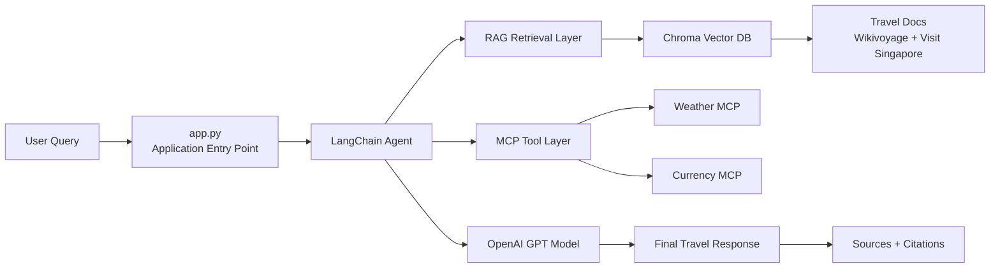

# Travel Assistant

An AI-powered Travel Assistant built using **Retrieval-Augmented Generation (RAG)**, **LangChain Agents**, **Model Context Protocol (MCP)**, **OpenAI GPT models**, and **Chroma Vector Database**.

---

## Repository

GitHub Repository:  
https://github.com/Jasmeet02/SingaporeTravelAssistant

Clone the repository:

```bash
git clone https://github.com/Jasmeet02/SingaporeTravelAssistant
cd SingaporeTravelAssistant
```

---

## App Architecture

The application is built as a layered AI system that combines local knowledge retrieval with live external tools:



### Core components

- **Application entry point**: `app.py` loads documents, creates the vector store, initializes the retriever, and wires the tool-using agent.
- **RAG layer**: retrieves travel knowledge from Chroma using embeddings generated from Singapore travel documents.
- **MCP tool layer**: fetches live weather and currency data from external services.
- **Agent orchestration**: decides when to use retrieval, tool calls, or both based on the user request.
- **Knowledge base**: documents stored in the `docs/` folder and indexed into the local Chroma database.
- **Conversation tracking**: session context is preserved through the history module and related state management.

### Project structure

- `app.py` — main application and orchestration logic
- `history.py` — conversation history handling
- `docs/` — source travel guides and itineraries
- `travel_mcp/` — MCP server implementations for weather and currency
- `chroma_db1/` — persisted local vector database

---

## Architecture

### RAG Pipeline

- Documents chunked at 400 tokens with 50-token overlap
- Embeddings generated using `text-embedding-3-small`
- Stored in Chroma Vector DB
- Retrieved chunks passed into the RAG prompt

### MCP Tools

- **Weather MCP**: retrieves current conditions and forecasts from Open-Meteo
- **Currency MCP**: converts amounts between INR, SGD, and USD

### LangChain Agent

- Orchestrates tool selection
- Ensures correct separation of destination information (RAG) and current information (MCP)
- Enforces strict rules to avoid hallucination and always cite sources

### Knowledge Base Sources

- Wikivoyage Singapore Travel Guide
- Visit Singapore Essential Information
- Visit Singapore Things To Do
- Visit Singapore Sample Itineraries

Each source is chunked, embedded, and stored with metadata including the title and URL for citation.

---

## Workflow

1. User asks a question.
2. The agent decides whether to call RAG, MCP, or both.
3. RAG retrieves relevant chunks from Chroma.
4. MCP tools fetch live data such as weather and currency.
5. The agent combines outputs into a structured response:
   - Destination Information (facts from RAG)
   - Current Information (from MCP)
   - Recommendations (LLM suggestions)
6. Sources are always listed at the end.

---

## Prompt Strategy

### RAG Prompt

- Restricts answers to retrieved context only
- Enforces a “Sources Used” section
- Prevents hallucination

### Agent Prompt

- Governs tool orchestration
- Ensures correct separation of facts vs. recommendations
- Handles missing knowledge (`RAG_STATUS: NOT_FOUND`) gracefully
- Prevents fallback to unsupported knowledge

---

## Sample Questions

### RAG Only

“Top attractions in Singapore”

→ Retrieves attractions from Wikivoyage and VisitSingapore documents

### MCP Only

“Convert 200 SGD to INR”

→ Uses the Currency MCP tool

### Combined RAG + MCP

“Plan a 3-day trip to Singapore next week and adjust for weather”

→ Retrieves itinerary suggestions from RAG
→ Fetches forecast from Weather MCP
→ Produces a weather-aware itinerary with indoor alternatives

## Setup

### Install dependencies

```bash
pip install -r requirements.txt
```

### Run the application

```bash
python app.py
```

---

## Deliverables Checklist

- ✅ Knowledge base from 3+ sources
- ✅ Embedding-based semantic retrieval
- ✅ Grounded answers with citations
- ✅ Weather MCP tool
- ✅ Currency MCP tool
- ✅ Combined RAG + MCP response
- ✅ Multi-turn conversation with context retention
- ✅ Clear handling of missing knowledge/tool failures
- ✅ Simple CLI interface

---

## Demo

Example run:

> Your question: Plan a three-day trip to Singapore next week and adjust the activities based on the weather forecast.

### Destination Information (from RAG Knowledge Base)

- Day 1: Marina Bay Sands, Gardens by the Bay
- Day 2: Sentosa Island, Universal Studios
- Day 3: Chinatown, National Museum

### Current Information (from MCP Tool Result)

- Weather forecast: Rain expected on Day 2

### Recommendations

- Replace outdoor activities on Day 2 with indoor options such as ArtScience Museum and SEA Aquarium.

### Sources Used

- Wikivoyage Singapore Travel Guide
- Visit Singapore Things To Do
- Weather MCP Server (Open-Meteo)
